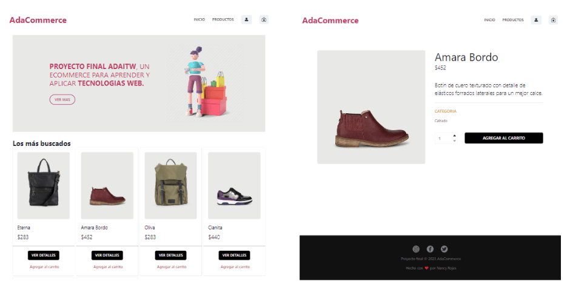
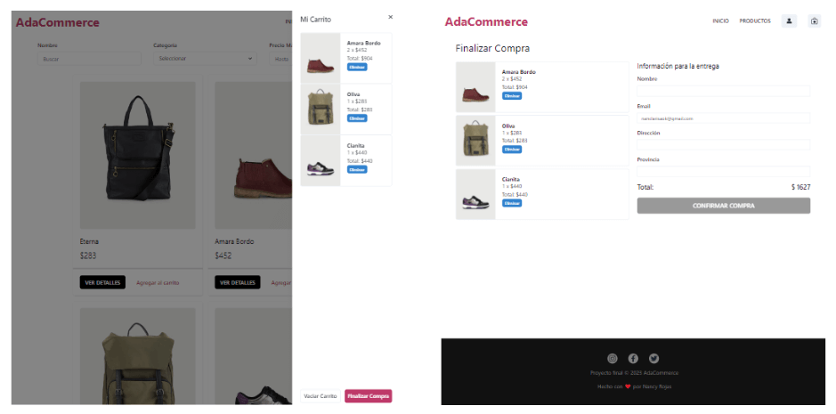

# AdaCommerce 🛒

## 👇 Sobre el proyecto

Este **proyecto** fue desarrollado para el Módulo final de la carrera de `Desarrollo Frontend 15va` de [Ada ITW](https://adaitw.org/).

---

## Descripción del proyecto

Este proyecto es una aplicación de comercio electrónico llamada AdaCommerce. Permite a los usuarios explorar y comprar productos, además de administrar su carrito de compras.

---

## Funcionalidades

- Visualizar lista de productos disponibles.
- Ver detalles de un producto específico.
- Agregar productos al carrito de compras.
- Filtrar productos por nombre, categoría y precio máximo.
- Modificar la cantidad de productos en el carrito.
- Eliminar productos del carrito.
- Realizar el proceso de compra.
- Iniciar sesión y registro de usuario con email y contraseña.
- Iniciar sesión y registro de usuario con Google.

---

## Construido con 🛠️

- **React JS** Biblioteca de JavaScript para contruir interfaces de usuario.
- **Vite** Entorno de desarrollo ultrarrápido para aplicaciones web modernas.
- **Chakra UI** Biblioteca de componentes para React que facilita la creación de interfaces de usuario atractivas y receptivas.
- **Firebase** Plataforma de desarrollo de aplicaciones en la nube que proporciona una variedad de servicios backend.
- **ESLint** Herramienta de análisis de código estático para identificar y reportar patrones problemáticos en el código JavaScript.
- **Prettier** Formateador de código que ayuda a mantener un estilo de código consistente y legible.
- **React Hook Form** Biblioteca de validación y manejo de formularios para React.
- **React Router** Biblioteca para el enrutamiento de la aplicación de una página a otra.
- **Vercel** Plataforma de implementación y alojamiento de aplicaciones web.
- **Chakra Icons** Biblioteca de iconos de Chakra UI que se pueden utilizar en tus componentes.
- **React Icons** Biblioteca de iconos de React que se pueden utilizar en tus componentes.

---

## Instalación 🔧

- Clona este [repositorio](https://ada-commerce.vercel.app/).
- Navega hasta el directorio del proyecto en tu terminal.
- Instala las dependencias del proyecto utilizando
  `npm install`
- Crea un proyecto en Firebase y obtén las credenciales de configuración.
- Crea un archivo .env en la raíz del proyecto y añade las credenciales de Firebase de la siguiente manera:

### Importante: Configuración de Firebase

Este proyecto utiliza Firebase para su funcionamiento. Para evitar comprometer tus credenciales de Firebase, sigue los pasos a continuación:

1. Crea un archivo `.env` en la raíz del proyecto.
2. Agrega las siguientes variables de entorno en el archivo `.env` y reemplaza los valores correspondientes con tus propias credenciales de Firebase:

```
VITE_FIREBASE_KEY=<tu_api_key>
VITE_FIREBASE_DOMAIN=<tu_auth_domain>
VITE_FIREBASE_PROJECT_ID=<tu_project_id>
VITE_FIREBASE_STORAGE_BUCKET=<tu_storage_bucket>
VITE_FIREBASE_SENDER_ID=<tu_sender_id>
VITE_FIREBASE_APP_ID=<tu_app_id>
```

3. Asegúrate de que el archivo `.env` se encuentre en el archivo `.gitignore` para evitar que se suba al repositorio. Si aún no tienes un archivo `.gitignore`, crea uno en la raíz del proyecto y agrega la línea `.env` al archivo.

¡Importante! Nunca subas el archivo `.env` a tu repositorio público en GitHub u otros servicios de control de versiones. Mantén tus credenciales de Firebase en privado para proteger tu proyecto.

Si tienes alguna pregunta sobre la configuración de Firebase, no dudes en consultar la documentación oficial de Firebase.

- Ejecuta el comando npm start para iniciar la aplicación en modo de desarrollo.

---

### Estas son algunas screenshots de la aplicación

---

- Página de inicio - Detalle del producto

---

## 

---

- Carrito de compras - Checkout

---



---

- Detalle del pedido - Filtrado del producto

---


## Agradecimientos 🤗

Quisiera aprovechar este espacio para expresar mi sincero agradecimiento a todas las personas que hicieron posible este proyecto:

- A Ada ITW por brindarme la oportunidad de formarme como desarrolladora y proporcionarme una plataforma de aprendizaje enriquecedora. Estoy agradecida por todo el apoyo y recursos que me brindaron.

- A mis profesores por su dedicación, apoyo y conocimientos compartidos a lo largo de mi aprendizaje. Su guía ha sido fundamental en el desarrollo de este proyecto.

- A mis compañeras por su colaboración y aliento durante toda la cursada. Su compañerismo ha sido inspirador y me ha motivado a seguir mejorando.

Estoy agradecida por la experiencia y el aprendizaje que he obtenido. Sin su contribución, este proyecto no habría sido posible.

¡Muchas gracias a todos!

⌨️ con ❤️ por Nancy 😊

Te invito a visitar [AdaCommerce](https://ada-commerce.vercel.app/)❗
